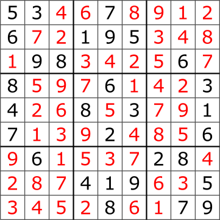

# Първо домашно по ФП

**Срок:** 26 ноември, 17:00

> В текущата директория има по един файл с unit тестове за всяка задача. Решенията си пишете в тези файлове и ги предавате в zip архив в мудъл.
#### [Сваляне на файловете](https://download-directory.github.io/?url=https%3A%2F%2Fgithub.com%2Ftriffon%2Ffp-2021-22%2Ftree%2Fmaster%2Fhomeworks%2F1-scheme)

> Unit тестовете са за улеснение при решаване на задачите. Те не са изчерпателни. При оценяването се гледа вашият код и дали отговаря на условието.

### [Зад 1][p1] (2т.)
Функция `automorphic?`, която намира дали дадено число е автоморфно,
тоест дали квадратът му завършва на него.

```scheme
(automorphic? 6) -> #t  ; 6^2  = 36
(automorphic? 5) -> #t  ; 5^2  = 25

(automorphic? 4) -> #f  ; 4^2  = 16
(automorphic? 11) -> #f ; 11^2 = 121
```

### [Зад 2][p2] (4т.)
Функция `count-pairs-gcd`, която намира броят на наредените двойки от цели числа
от интервала [a,b], които имат най-голям общ делител равен на `n`.

### [Зад 3][p3] (4т.)
Функция `min-duplicate`, която по списък от числа намира най-малкото число,
което се среща поне 2 пъти в списъка.

```scheme
(min-duplicate '(1 2 3 8 3 3 6 6 8 4)) -> 3
```

### [Зад 4][p4] (5т.)
Функция `sudoku-solved?`, която приема списък от атоми `alphabet` и поле с размер 9x9 `board`.
Функцията намира дали полето изпълнява правилата на судоку - всеки ред, колона и
всяко 3x3 подполе да съдържа точно всички елементи от `alphabet`.

Ако `alphabet` е `'(1 2 3 4 5 6 7 8 9)` (вкл. и друга пермутация на този списък),
то говорим за стандартните правила на судоку, в които редовете, колоните и
подполетата съдържат цифрите от 1 до 9 без повторение.

Други примери за `alphabet` са `'(a b d e i k p r w)` и `'(I II III IV V VI VII VIII IX)`,
като тогава играта се нарича съответно "Wordoku" и "Quadratum latinum".

Подполетата са 9 на брой, имат размер 3x3, образуват разбиване на полето (тоест не се припокриват и
обединението им е цялото поле) и винаги започват в ред и колона кратни на 3.
На следната картинка удебелените линии очертават подполетата:



Полето се подава като втори аргумент на `sudoku-solved?` във вид на списък от редове.
За горната картинка, полето се представя като:

```scheme
(define example-board1
  '((5 3 4  6 7 8  9 1 2)
    (6 7 2  1 9 5  3 4 8)
    (1 9 8  3 4 2  5 6 7)

    (8 5 9  7 6 1  4 2 3)
    (4 2 6  8 5 3  7 9 1)
    (7 1 3  9 2 4  8 5 6)

    (9 6 1  5 3 7  2 8 4)
    (2 8 7  4 1 9  6 3 5)
    (3 4 5  2 8 6  1 7 9)))
```
Очаква се `(sudoku-solved? '(1 2 3 4 5 6 7 8 9) example-board1)` да върне `#t`.

А за неправилно поле, например:
```scheme
(define example-board2
  '((5 3 4  6 7 8  9 1 2)
    (6 5 2  1 9 7  3 4 8)
    (1 9 8  3 4 2  5 6 7)

    (8 5 9  7 6 1  4 2 3)
    (4 2 6  8 5 3  7 9 1)
    (7 1 3  9 2 4  8 5 6)

    (9 6 1  5 3 7  2 8 4)
    (2 8 7  4 1 9  6 3 5)
    (3 4 5  2 8 6  1 7 9)))
```
се очаква `(sudoku-solved? '(1 2 3 4 5 6 7 8 9) example-board2)` да върне `#f`,
тъй като в първото подполе се среща два пъти `5`.


[p1]: ./01.automorphic.rkt
[p2]: ./02.count-pairs-gcd.rkt
[p3]: ./03.min-duplicate.rkt
[p4]: ./04.sudoku.rkt
